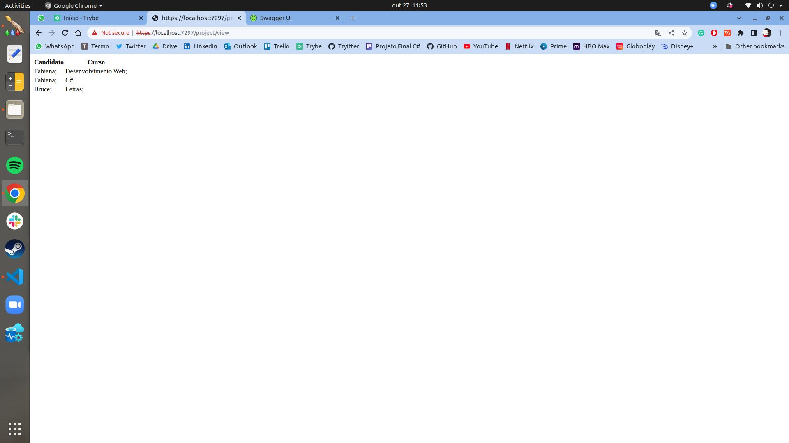

Readme
## Para rodar o projeto:

Olá. Para este projeto utilizei o EntityFramework junto com o SQLite e swagger para auxiliar na chamada dos endpoints. Para rodar o projeto basta executar os comandos:

``` shell
dotnet restore
dotnet run
```

E accessar https://localhost:7297/swagger/index.html

Aqui você poderá executar os enpoints para adicionar `cursos`, `candidatos` e `inscricoes`.

.

Para visualizar todas as incrições acesse https://localhost:7297/project/view

.

## Débitos

* Testes unitários
* Views para adicionar `cursos` e `candidatos`